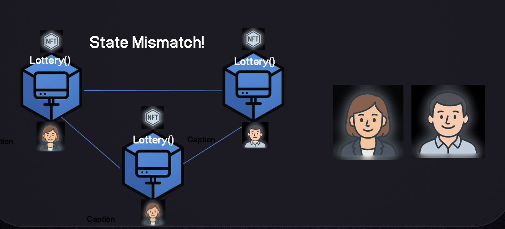
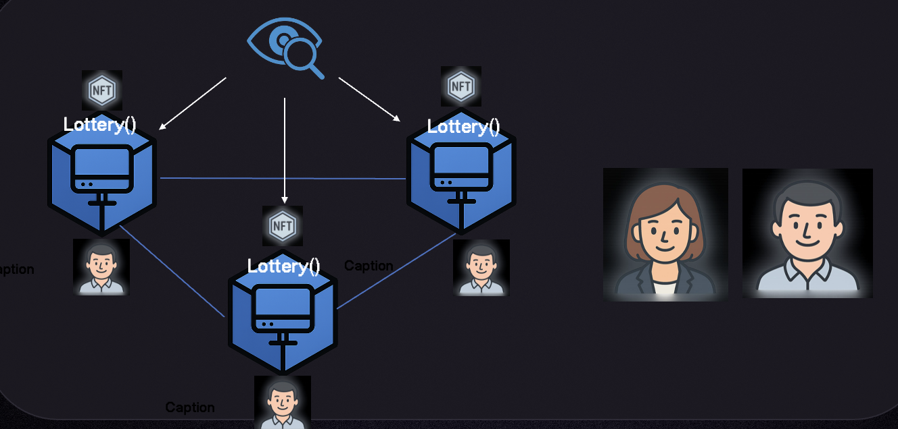
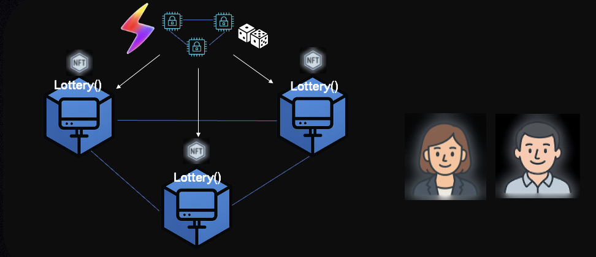
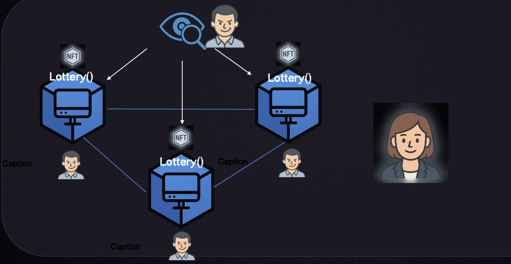

# Randomness Overview

Blockchain users want randomness for many applications like gaming, NFT mints, lotteries, and more. However, this poses a fundamental challenge to blockchains, which are deterministic computers replicated across many nodes across the globe. Each node needs to produce the exact same output when given the same sequence of inputs.

Imagine if an on-chain lottery was deciding whether to mint an NFT to Alice or Bob. If blockchain nodes ran their own randomness and some decided that the NFT would go to Alice, and others to Bob, there would be a state mismatch.

<figure><figcaption></figcaption></figure>

This is where oracles come in. An oracle can run the randomness off-chain and then post a single result to the blockchain, ensuring that all nodes agree on the result of the randomness.

<figure><figcaption></figcaption></figure>

However, as a third-party source of randomness, it's critical to make sure that nefarious actors cannot control the oracle and bias the randomness in their favor.

<figure><figcaption></figcaption></figure>

## Switchboard’s approach

Switchboard leverages Trusted Execution Environments (TEEs), which are protected areas inside of a computer's processing unit that cannot be altered or inspected. This means:

- No one, including the oracle operator, can alter the code that’s running on the TEEs
- No one, including the oracle operator, can see what’s going on inside the chip, only inputs and outputs.

This means that Switchboard oracles can generate safe and fair randomness that is free from malicious influence. As an extra layer of protection, Switchboard network incentives ensure that oracle oeprators that misbehave by experiencing downtime or withholding results can have their $SWTCH stake slashed.

## How to Use Switchboard Randomness

To understand the flow, it's helpful to visualize the following 5 parties.

- **Alice**: blockchain user
- **App**: on-chain application
- **Switchboard Contract**: on-chain contract that handles anything Switchboard-related.
- **Crossbar**: server that helps you talk to oracles
- **Oracle**: generates randomness

<figure><figcaption></figcaption></figure>

There are two stages, requesting and resolving the randomness.

### Request Randomness
- First, **Alice** talks to the **App** requesting some random event.
- The **App** then generates a randomness request with a unique ID and sends it to the **Switchboard contract**.
- The **Switchboard contract** responds to the **App** with an oracle assignment.
- The **App** responds to **Alice** with the oracle assignment and randomness ID.
- **Alice** sends the oracle assignment, randomness ID, and some other data to **Crossbar** to request the randomness.
- **Crossbar** talks to the **Oracle** and requests randomness.
- The **Oracle** creates a randomness object and sends it to **Crossbar** which passes it back to **Alice**.

### Resolve Randomness
- **Alice** sends the randomness object to the **App**.
- The **App** asks the **Switchboard contract** to verify that the randomness it received from Alice is correct.
- If all is well, the **Switchboard contract** sends verification to the **App**, resolving the random event.

--
