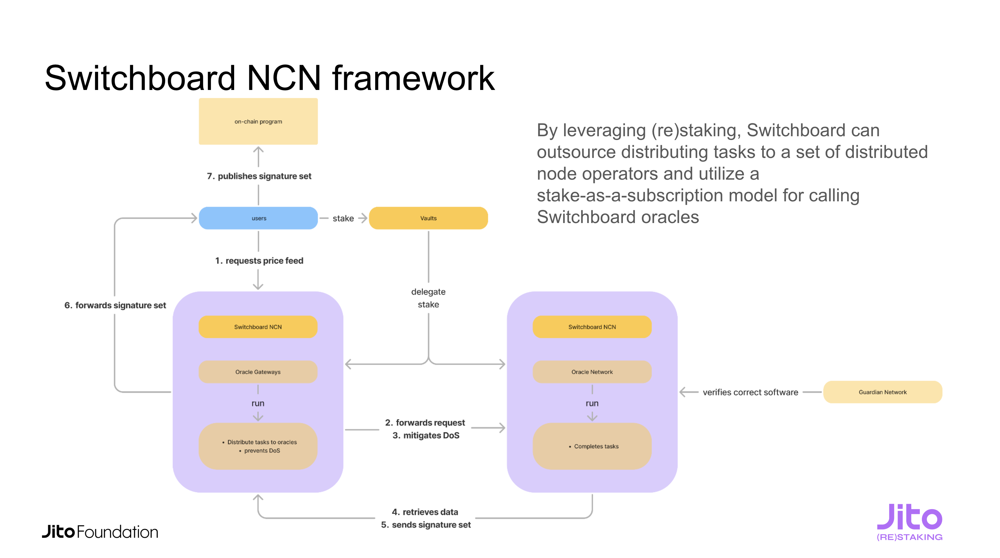

# The Switchboard NCN

## How does Switchboard use (re)Staking to secure the Switchboard network?

Switchboard oracles are a scarce and valuable resource. To protect the network from abuse (e.g., spam, denial-of-service attempts), and to maximize oracle performance, the network uses a staking-based mechanism powered by the Jito NCN framework.

### Incentivizing Oracle Performance with Stake

Although Switchboard oracles operate within secure Trusted Execution Environments (TEEs), they are still subject to real-world limitations like CPU load and network throughput. To incentivize optimal uptime, responsiveness, and resource management, Switchboard integrates with Jito’s staking vaults.

Stakers can delegate their stake to oracles. High-performing oracles will receive more stake over time, creating a reward feedback loop. Oracles with the most stake are prioritized in routing for new price requests, ensuring that the most performant nodes serve critical traffic.

### Managing Usage Limits with Stake

To prevent misuse of the network (e.g., users flooding price requests), Switchboard enforces a default rate limit of 20 requests per second (RPS) per user.

Users can raise this limit by staking $SWTCH tokens. When submitting a request, users can sign it with a wallet that holds stake, proving their economic commitment to the network. The more stake held, the higher the RPS limit granted to that user. This ties resource consumption directly to network value.

### Summary

By integrating staking into both **supply (oracles)** and **demand (users)**, Switchboard ensures a secure, performant, and economically aligned oracle network.

<figure><figcaption></figcaption></figure>
