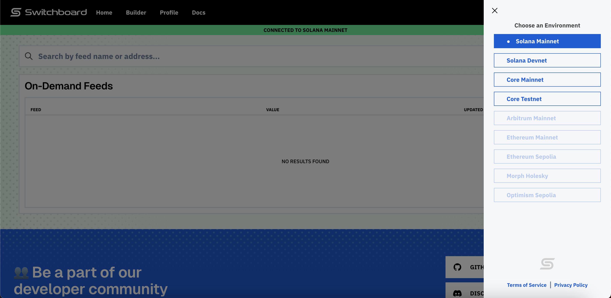
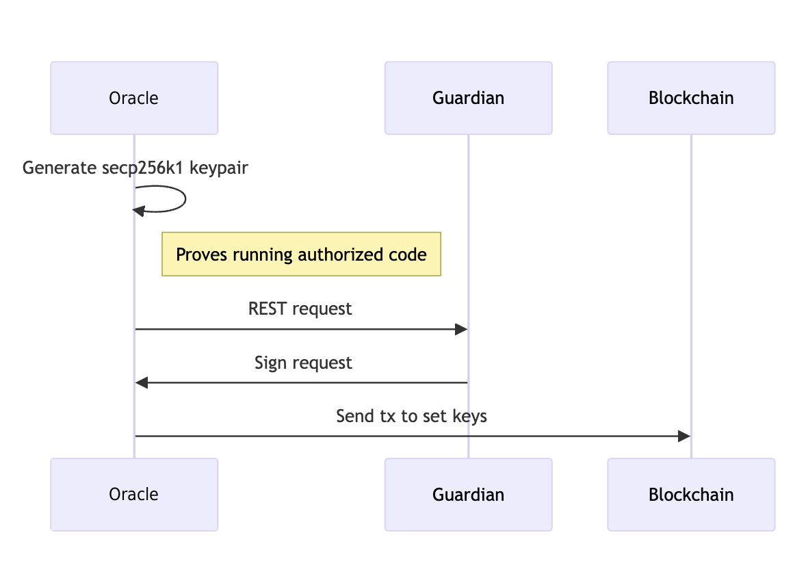

# Node Architecture

The Switchboard network distributes data processing across various node types, each with specific responsibilities. Understanding these node types is essential for grasping how data requests are handled and secured within the Switchboard architecture. The following table details each node type and its key functions:

| Node Type                    | Role/Function                                                                                                         | Key Features/Responsibilities                                                                                    |
| ---------------------------- | --------------------------------------------------------------------------------------------------------------------- | ---------------------------------------------------------------------------------------------------------------- |
| **Guardian**                 | Gatekeeper of Data Integrity                                                                                          | Verifies Oracle code integrity, Bridges blockchains and TEE, Initiates TEE verification, Strict approval process |
| **Oracle**                   | Decentralised Access — Acts as a web API for public access                                                            | Segregated internal components for security and efficiency                                                       |
| **Oracle Router — Frontend** | Traffic Controller-Mitigation of DoS threats — Protects the internal environment from Denial of Service (DoS) attacks | Front-end traffic control                                                                                        |
| **Oracle Router — Gateway**  | Task Distributor — Assigned tasks efficiently across workers                                                          | Calculates the best way to assign different tasks with different parameters                                      |
| **Oracle Worker**            | Task Executioner — Runs code for data retrieval and signing                                                           | Executes tasks assigned to worker                                                                                |

## Guardian and Oracle Onboarding

Guardians play a crucial role in the Switchboard network by verifying that oracles and other guardians are running the correct software images. This verification process involves checking their Trusted Execution Environment (TEE) attestations. Once approved, guardians can proceed through the guardian attestation process and act as validators for the network.

**Step 1: Initial Onboarding as Root of TEE Attestation.**

Guardians are first and foremost onboarded into the network as the root validators of TEE attestations. This inaugural step is necessary to establish their pivotal role as the secure bridge between TEE attestation practices and the blockchain itself.

Here is a visual representation of the entire process:

<figure><figcaption></figcaption></figure>

Following successful verification, a minimum of one-third of all guardians are required to attest to the TEE attestations of each oracle. This ensures robust validation and security across the Switchboard network.

## Oracle Onboarding

Before any attestation can occur, all oracle nodes must first successfully navigate a pre-approval process. Only then can they formally seek guardian approval. Once an oracle has been both approved and verified that the correct software image is running, said entity gains the ability to join the Oracle Queue.

**Step 2: Guardian Attestation and Addition to Oracle Queue**

The Guardian attests to the oracle's TEE attestation and, upon successful verification, adds the oracle to the Oracle Queue.

<figure><figcaption></figcaption></figure>

**Important Keypair Verification Note:** Similar to oracles, guardians must also undergo a keypair verification process, ensuring that all secp256k1 keypairs are considered valid for a period of seven days, after which they must undergo a re-verification.

Following the successful completion of the onboarding procedures for both guardians and oracles, users can then commence the process of requesting price signatures to be used on-chain.

## The Lifespan of a Data Feed Request

Once onboarded, users have the flexibility to define their custom data feeds and solicit updates from oracle nodes within the network. This process ensures that the data returned to the user includes essential data feed outputs, and any signatures required to validate data updates on-chain.

**Step 3: User Request and On-Chain Posting**

The user requests data from a specified feed through the gateway. In response, the user receives a signature-set. The user then posts this signature-set on-chain to update the data.

Users can request up-to-date data from a specified feed through the gateway. Following a response, the user receives a signature set, which is then posted on-chain to update the data.

<figure><figcaption></figcaption></figure>
