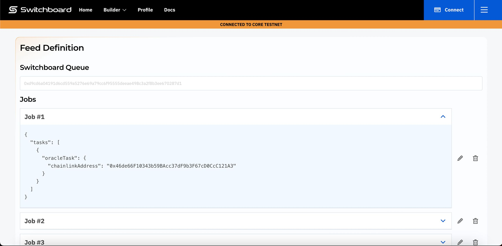
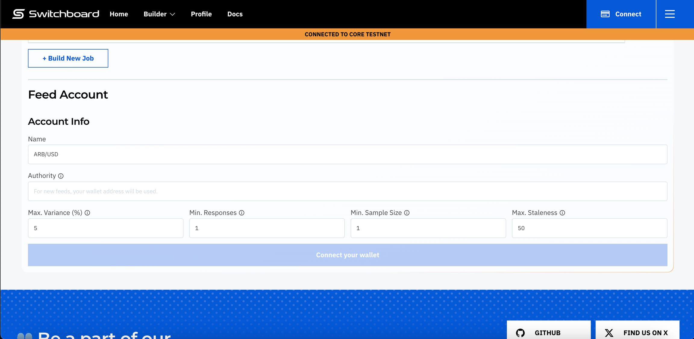
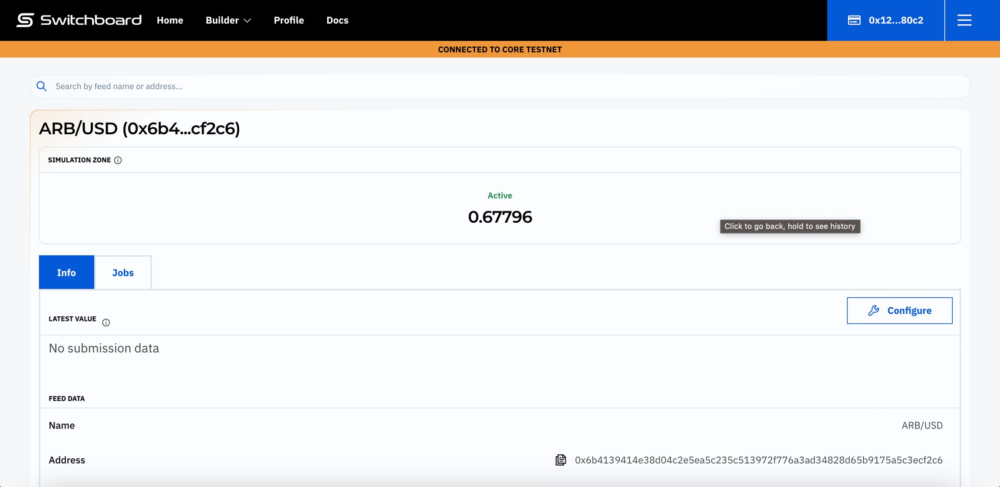

# How to use the Switchboard Oracle Aggregator

Welcome to the Switchboard Aggregator walk-through! In this guide, you will learn how we are consolidating data from many resources across the internet, on-chain and off-chain. You'll discover that Switchboard enables you to build custom jobs which leverage existing oracles (like Pyth and Chainlink), pulling data from numerous oracles to generate one unified, and more reliable result. The `OracleTask` is available for you to use in creating your own data-sourcing logic, providing access to data feeds from other Oracle providers. Best of all, Switchboard automatically resolves and sets the feed value by calculating the median of each Oracle Job output.

Ready to create your own feed using the Switchboard Aggregator? Let's start by utilising the [aggregator builder interface](https://beta.ondemand.switchboard.xyz/aggregator) to quickly build a task in the web browser.

### Building a Feed

Follow along with this tutorial and video that demonstrates how to use the oracle aggregator to create a feed that fetches data from other Oracle providers.



#### Step 1: Finding Your Data Pair

The first task is to find the specific data feed you need. Our aggregator builder interface offers a wide selection of feeds from various sources, including:

* Pyth (Pythnet)
* Chainlink (Arbitrum)
* Major Exchanges (via Switchboard)

You can access all these feeds in our Oracle Aggregator Interface. Browse this page, and when you find the pair you're interested in (e.g., BTC/USD), click on it.

<figure><figcaption></figcaption></figure>

#### Step 2: **Inspecting the Feed Configuration**

After selecting your desired pair, you'll be taken to a page where you can view the feed's current configuration:

<figure><figcaption></figcaption></figure>

Here, you can inspect the individual “jobs” that make up the feed. Each job represents a specific data source. You can edit or delete jobs using the icons on the right-hand side. For example, if you prefer not to include data from Chainlink, you can simply remove (delete) the associated job by clicking the trash-bin/delete icon.

#### Step 3: Configuring Your Feed

Now, it's time to configure your feed according to your specific needs.

1.  **Network Selection:** First, ensure you're connected to the correct network. You can configure this by clicking the network/settings icon, typically located in the upper-right corner of the interface.

    <figure><figcaption></figcaption></figure>
2. **Feed Configuration Inputs:** You'll see a series of input fields with default values. An empty “Name” field will also be present. Let's review what these fields mean:
   * **Name:** This is the identifier for your feed within the Switchboard UI. Choose a descriptive name that helps you easily recognise the feed (e.g., “My Custom BTC/USD Feed”).
   * **Authority:** This is the Solana address that has the power (“authority”) to modify this feed's settings in the future. By default, the feed's creator is the authority, however to improve composability one can change their authority for their organisation or project's governance address. This is useful for data feeds controlled by DAOs.
   * **Max Variance:** This sets the maximum percentage difference allowed between individual job results for an update to be considered valid and accepted on-chain. Variance is often referred to as deviation, and we do not advise we update the feed for a deviation that exceeds `Max Variance`.
   * **Min Responses:** This specifies the minimum number of successful Oracle Job responses required for an update to be accepted. If fewer than this number of jobs succeed (e.g., due to a node outage), the feed will not update its value on-chain.
   * **Sample Size:** This determines the number of oracles (samples) that the price will be collected from when reading a feed.
   * **Max Staleness:** This defines the maximum age (staleness) allowed for a data sample when the feed is read on-chain. Data older than this will be considered invalid.

<figure><figcaption></figcaption></figure>

#### Step 4: Creating the Feed

Once you are satisfied with all feed configurations listed above, click the “Connect Wallet” button. After you've connected using your preferred wallet, you'll automatically navigate to the feed's status page.

This page provides simulated prices, which refresh periodically, giving you a preview of how the feed will behave with real-world data. This will hopefully give users more context in testing environments before deployment to mainnet. Pay close attention to the Address, since we'll require it later when integrating this on-chain.

<figure><figcaption></figcaption></figure>

Make sure you take note of the **Address**, we'll need it to integrate on-chain.
